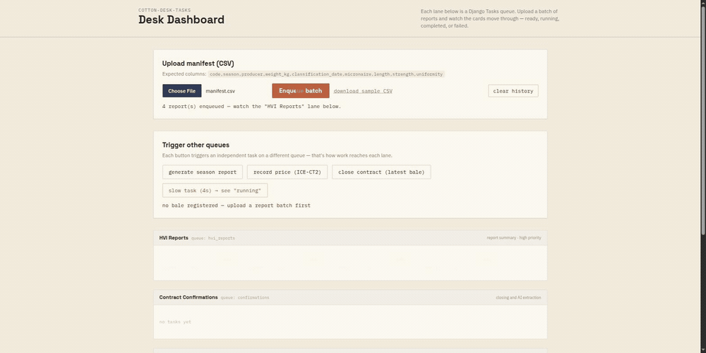

# cotton-desk-tasks

[](https://www.python.org/)
[](https://www.djangoproject.com/)
[](https://ai.pydantic.dev/)
[](https://docs.astral.sh/uv/)

Operational dashboard for a cotton trading company, built on Django 6's
native Task Framework (via
[`django-tasks-db`](https://pypi.org/project/django-tasks-db/)), as a
study project for the framework — covering HVI report summaries, season
reports, contract confirmation, and structured data extraction via
[PydanticAI](https://ai.pydantic.dev/) + Gemini.



Uploading a manifest enqueues one summary per row. The cards move through
`READY` → `RUNNING` → `SUCCESSFUL`/`FAILED` on their own, and a report
outside the commercial range surfaces as a real failure with the reason
attached — the last bale in the batch has a micronaire of 2.80, below the
3.5 minimum.

## Table of Contents

- [Scenario](#scenario)
- [Architecture decisions](#architecture-decisions)
- [Structure](#structure)
- [Task queues](#task-queues)
- [Setup](#setup)
- [Makefile](#makefile)
- [Usage](#usage)
- [Tests](#tests)
- [Code quality](#code-quality)
- [Security](#security)
- [Known limitations](#known-limitations)
- [Credits](#credits)

## Scenario

Cotton Desk receives HVI reports from the lab, closes contracts with
buyers, and needs to keep reference price indices (ICE, CEPEA) updated
daily. Each of these operations triggers asynchronous processing —
summarizing a report, consolidating a season, generating the textual
confirmation of a contract — that must not block the response to the
user. The dashboard at `/dashboard/` shows these tasks in real time (via
polling), transitioning between the states `READY` → `RUNNING` →
`SUCCESSFUL`/`FAILED`.

## Architecture decisions

The highest-impact decisions are recorded in [`ADR.md`](ADR.md):

| ADR | Decision |
|-----|----------|
| 001 | Django Tasks Framework (`django-tasks-db`) instead of Celery |
| 002 | PydanticAI + Gemini for structured extraction of confirmations |
| 003 | Simple polling on the dashboard, instead of WebSocket |

Each ADR documents not just the decision, but the trade-offs experienced
in practice and the concrete trigger that would justify revisiting it.

## Structure

```
.
├── config/                          # settings, urls, wsgi/asgi for the Django project
├── desk/
│   ├── models.py                    # Bale, HVIReport, Contract, PriceIndex
│   ├── domain.py                    # HVIParameters — business validation, no Django
│   ├── tasks.py                     # async tasks (@task), one per queue
│   ├── extraction.py                # PydanticAI agent for confirmation extraction
│   ├── views.py                     # HTTP endpoints + dashboard
│   ├── urls.py
│   ├── templates/desk/dashboard.html
│   ├── management/commands/register_price.py
│   └── tests/
├── ADR.md                           # recorded architecture decisions
└── manage.py
```

`domain.py` doesn't depend on Django or the database — validating the HVI
parameters (micronaire, length, strength, uniformity) is a pure value
object, testable in isolation. `HVIReport.to_domain()` is the single
conversion point between the raw saved data and the business rule.

## Task queues

| Queue           | Task                     | Priority | What it does |
|-----------------|--------------------------|----------|--------------|
| `hvi_reports`   | `summarize_report`       | 50       | Summarizes an HVI report from its validated parameters |
| `season_reports`| `generate_season_report` | -10      | Consolidates how many reports from a season are commercially valid |
| `confirmations` | `confirm_contract`       | 50       | Generates the textual confirmation of a closed contract |
| `confirmations` | `extract_confirmation`   | 30       | Extracts data from free text via AI and creates the contract |
| `prices`        | `record_index_reading`   | 0        | Persists a price index reading |
| `demo`          | `demo_task`              | 0        | Artificially slow task, just to show the `RUNNING` state on the dashboard |

## Setup

```bash
uv sync
echo "GOOGLE_API_KEY=your-key-here" >> .env
uv run python manage.py migrate
make hooks   # installs the pre-commit hooks
```

The key is read from `GOOGLE_API_KEY` and used by the PydanticAI agent in
`desk/extraction.py`. Without it, only the flows that actually call the
Gemini API (`extract_confirmation`) become unavailable — the rest of the
project works normally.

The `.env` is loaded by `config/settings.py`, which also reads the
settings below. All of them have development defaults, so the project runs
with nothing but `GOOGLE_API_KEY` set:

| Variable | Default | Notes |
|---|---|---|
| `GOOGLE_API_KEY` | — | only needed by `extract_confirmation` |
| `DJANGO_DEBUG` | `True` | set to `False` for a production-shaped run |
| `DJANGO_SECRET_KEY` | dev fallback | **required** when `DEBUG=False`; startup refuses the fallback otherwise |
| `DJANGO_ALLOWED_HOSTS` | `localhost,127.0.0.1` | comma-separated |

## Makefile

The install, run, test, and quality commands below are also available as
shortcuts via `make` (`make help` lists them all):

```bash
make install    # uv sync
make hooks      # installs the pre-commit hooks
make hooks-run  # runs every hook against the whole repository
make migrate    # manage.py migrate
make run        # manage.py runserver
make worker     # manage.py db_worker
make test       # test suite
make lint       # ruff check
make format     # ruff format
make ci         # lint + format-check + pip-audit + tests (same pipeline as CI)
```

## Usage

```bash
# development server
uv run python manage.py runserver

# worker that processes the queues (another terminal)
# '*' means every queue: db_worker otherwise only watches a queue named
# "default", which this project doesn't define — tasks would stay in READY.
uv run python manage.py db_worker --queue-name '*'

# record a price index reading (e.g. via cron)
uv run python manage.py register_price ICE-CT2 82.35 2026-04-28
```

With both processes running, the dashboard is at
`http://localhost:8000/dashboard/`, with demo buttons to enqueue each
type of task and watch the state transitions. The worker accepts
`--interval` to adjust its own database poll frequency (this only
affects dashboard visibility, not the task's execution duration).

## Tests

```bash
uv run pytest
```

The suite doesn't depend on the network: the extraction test
(`test_extract_confirmation.py`) uses `Agent.override()` with
PydanticAI's `TestModel`, and the task tests use the Django Tasks
Framework's test backends (`ImmediateBackend`) or `DatabaseBackend`
directly when the real worker's behavior matters (`test_worker_real.py`).

## Code quality

Lint and formatting with [Ruff](https://docs.astral.sh/ruff/):

```bash
uv run ruff check              # lint
uv run ruff check --fix        # lint + automatic fixes
uv run ruff format             # formatting
```

Or via `make lint`, `make lint-fix`, `make format`, `make format-check`.
`make ci` runs the same pipeline used in GitHub Actions.

The same checks run as [pre-commit](https://pre-commit.com/) hooks
(`.pre-commit-config.yaml`), so formatting problems surface at commit time
instead of in a red pipeline. Install them once with `make hooks`.

[GitHub Actions](.github/workflows/ci.yml) has two jobs:

- **`lint-and-test`** (blocking) — `ruff check`, `ruff format --check`, a
  migration-drift check, and the test suite, on every push/PR to `main`.
- **`audit`** (advisory) — `pip-audit`, also on a weekly schedule. It runs
  with `continue-on-error` on purpose: its findings are almost always CVEs
  in transitive dependencies, unrelated to the pull request at hand, and
  blocking merges on those means an unrelated disclosure freezes the
  repository. Treat a red `audit` as a task, not as a broken build.

## Security

- **No secrets in version control.** `GOOGLE_API_KEY`, `DJANGO_SECRET_KEY`,
  `DJANGO_DEBUG` and `DJANGO_ALLOWED_HOSTS` all come from `.env`, which is
  gitignored. The `SECRET_KEY` has a development fallback so the demo runs
  out of the box, and `config/settings.py` refuses to start with that
  fallback when `DEBUG` is off. PydanticAI's `Agent` is created with
  `defer_model_check=True` so a missing key doesn't break the whole suite
  just from importing the module.
- **Every POST endpoint is CSRF-protected.** The dashboard sends the token
  from ` csrf_token `
  as an `X-CSRFToken` header on each `fetch`. This matters most for
  `checkout` (creates a contract) and `clear_tasks` (deletes the whole
  history) — a cross-site POST to either used to go through.
- **Request input is validated at the edge.** Missing or malformed fields
  return `400`, an unknown bale returns `404`, and a batch upload is one
  transaction with a row cap, so a malformed row can't leave half a CSV
  persisted with work already queued.
- **A matching failure is treated as a real failure, not masked.** If
  `extract_confirmation` receives a bale code that doesn't exist, the
  task fails with `Bale.DoesNotExist` instead of trying a silent
  fallback — an LLM can hallucinate or get the code wrong, and that needs
  to stay visible for human triage.
- **`extract_confirmation`'s input text is processed by the Google
  Gemini API** (an external service). Don't use real contract, customer,
  or price data in the demo — use fictitious examples.

## Known limitations

- **No built-in scheduling.** `register_price` needs an external cron
  calling the management command; the native Tasks Framework has no
  Celery Beat equivalent.
- **State transitions shorter than the dashboard's poll interval (1.5s)
  are hard to observe.** `demo_task` exists just to make the `RUNNING`
  state visible, which passes too fast in the real tasks.
- **`ImmediateBackend` doesn't support `get_result()` by id** — checking
  a task's status after enqueueing requires `DatabaseBackend`.
- **No fuzzy bale matching.** If `extract_confirmation` receives an
  incorrect bale code, the task simply fails; there's no automatic
  suggestion of the closest bale.

## Credits

Study project for the Django Tasks Framework (`django-tasks-db`) and
PydanticAI, applied to the cotton trading domain.
